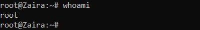

**Step 1: Switch to root user.**
Switch to root user so that we have the rights to create new users and groups.

<details>
<summary> Show hint
</summary><br>

Use the `sudo` command with flag `i`.

If you have the root password, you can login using that as well.

</details>

<details>
<summary> Show solution
</summary><br>

Enter `sudo -i` to switch to the root user.

Enter `whoami` to find out if you are the root user:



If you do not have `root` access, use the commands with appending `sudo`.

</details>

--- 

**Step 2: Create a group `dev-team`**

<details>
<summary> Show hint
</summary><br>

Use the `groupadd` command.

Syntax: `groupadd group-name`

</details>

<details>
<summary> Show solution
</summary><br>

Enter `groupadd dev-team` to create the `dev-team` group

Verify: `cat /etc/group | grep dev-team`


</details>

--- 

**Step 3: Create two new users John and Bob and add them to the `dev-team` group**


<details>
<summary> Show hint
</summary><br>

Use command `useradd`.

`useradd` creates a new user and adds to the specified group.

Syntax: `useradd -G groupname username`

Where `-G` specifies the group.

</details>

<details>
<summary> Show solution
</summary><br>

`useradd -G dev-team John`

`useradd -G dev-team Bob`

Verify: `cat /etc/group | grep dev-team`


  
</details>


--- 

**Step 4:  Provide passwords for users John and Bob**


<details>
<summary> Show hint
</summary><br>


Use command `passwd`

`passwd` creates a password for users.

Syntax: `passwd username`


</details>

<details>
<summary> Show solution
</summary><br>

`passwd John`

`passwd Bob`

</details>


--- 

**Step 5: Create a directory in /home and name it `dev-team`**


<details>
<summary> Show hint
</summary><br>


Use command `mkdir`

`mkdir` creates a directory.

Syntax: `mkdir directory-name`


</details>

<details>
<summary> Show solution
</summary><br>

`mkdir /home/dev-team`

Verify:


</details>


--- 


**Step 6: Change the group ownership of the folder `dev-team`  to group `dev-team`**


<details>
<summary> Show hint
</summary><br>

Use command `chown`

Syntax: `chown :group-name folder`


</details>

<details>
<summary> Show solution
</summary><br>

`chown :dev-team /home/dev-team/`


</details>


--- 

**Step 7: Make sure, the permissions of folder `dev-team` allows group members to create and delete files.**


<details>
<summary> Show hint
</summary><br>

Use command `chmod`

Write permissions allow users and groups to create and delete files.

Syntax: `chmod permissions folder`

</details>

<details>
<summary> Show solution
</summary><br>

`chmod g+w /home/dev-team/`


</details>


--- 


**Step 8: Ensure that 'others' don't have any access to the files of `dev-team` folder.**


<details>
<summary> Show hint
</summary><br>

Use command `chmod`

Remove read, write, execute  permissions from 'others' if they exist.

Syntax: `chmod permissions folder`


</details>

<details>
<summary> Show solution
</summary><br>

`chmod o-rx dev-team `


</details>


--- 

**Step 9: Exit the `root` session and switch to `John`**


<details>
<summary> Show hint
</summary><br>

Use command `exit` to logout of the root user.

Use `su` to switch users.

Syntax: `su - user`

To confirm current user, use command `whoami`.

</details>

<details>
<summary> Show solution
</summary><br>

`exit`

`su - John`

Verify with command `whoami`.

</details>


--- 


**Step 10: Navigate to folder: `/home/dev-team`**


<details>
<summary> Show hint
</summary><br>

Use command `cd` to switch folders.

Syntax: `cd /path/to/folder`

Confirm current path with `pwd`.

</details>

<details>
<summary> Show solution
</summary><br>

`cd /home/dev-team`

</details>


--- 


**Step 11: Create an empty file in the folder: `/home/dev-team`**


<details>
<summary> Show hint
</summary><br>

Use command `touch` to create an empty file.

Syntax: `touch filename`

</details>

<details>
<summary> Show solution
</summary><br>

`touch john-file.txt`

Verify: `ls -lrt`
  
`<add image>`
  
</details>


--- 


**Step 12:  Change the group ownership of the created file to `dev-team` and verify.**


<details>
<summary> Show hint
</summary><br>

Use command `chown` to change ownership.

Syntax: `chown :group file-name`

</details>

<details>
<summary> Show solution
</summary><br>

`chown :dev-team john-file.txt`

Once group ownership is modified, all members of the group can access this file.

Verify `ls -lrt`


</details>


--- 


**Step 13:  Exit the shell and switch to user `Bob`**


<details>
<summary> Show hint
</summary><br>

Use command `exit` to exit the terminal.

Use `su` to switch users.

Syntax: `su - user`

To confirm current user, use command `whoami`.

</details>

<details>
<summary> Show solution
</summary><br>

`exit`

`su - Bob`

Verify the current user with command `whoami`.

`<add image?>`

</details>


--- 


**Step 14: Navigate to the path `/home/dev-team`**


<details>
<summary> Show hint
</summary><br>

Use command `cd` to switch folders.

Syntax: `cd /path/to/folder`

Confirm current path with `pwd`.


</details>

<details>
<summary> Show solution
</summary><br>

`cd /home/dev-team`


</details>


--- 


**Step 15: Find out `Bob's` privileges to access `john-file.txt `**


<details>
<summary> Show hint
</summary><br>


Use command `ls -l` for long listing.

Syntax: `ls -l | grep file-name`

Does group have `rw-` permissions?


</details>

<details>
<summary> Show solution
</summary><br>

`ls -l | grep john-file.txt`


</details>


--- 


**Step 16: Modify the file `john-file.txt ` while logged in as `Bob`**


<details>
<summary> Show hint
</summary><br>

Use command `echo` to add some text to the file.

Syntax: `echo "Some text" > >file-name`

This would redirect the quoted text to end of the file.

</details>

<details>
<summary> Show solution
</summary><br>

`echo "This is Bob's comment" > john-file.txt`

If all the permissions are correctly set, `Bob` would be allowed to edit and save this file. Otherwise you would get an error like this: `Permission denied`.

Verify `cat john-file.txt`
  
</details>


--- 


**Step 17: Create another group `project-manager` and assign a member `Fatima` to it**


<details>
<summary> Show hint
</summary>

Use command `groupadd` to add a new group.

Syntax: `groupadd group-name`


Create a new user with command `useradd`.
Use flag `-G` to assign a user to it.

</details>

<details>
<summary> Show solution
</summary>

```
groupadd project-manager
useradd -G project-manager Fatima
passwd Fatima
```

</details>


**Step 18: Navigate to folder `/home/dev-team` and verify if  `Fatima` can access it**


<details>
<summary> Show hint
</summary>

Use `cd` to navigate to `/home/dev-team`.

</details>

<details>
<summary> Show solution


</summary>

`cd /home/dev-team`.

We get this error:


This is because, `others` don't have any access to the folder `dev-team`.

If we recall, below are the rights of the `dev-team` folder.


</details>